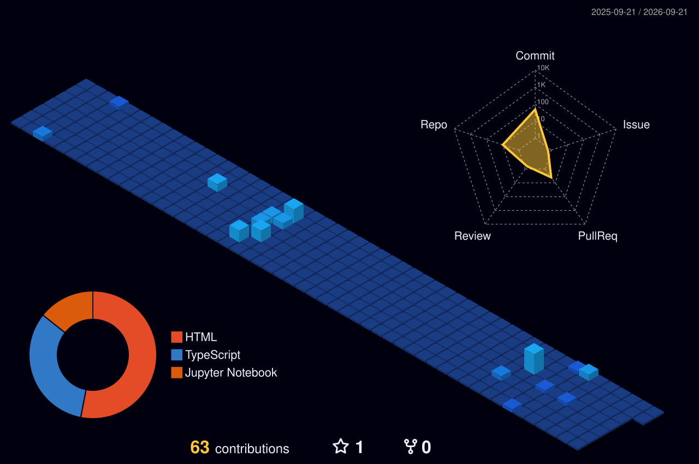

<!-- JARVIS ANIMATED WAVE HEADER -->

  

<!-- GLITCH EFFECT NAME -->

  <h1>
    
      <glitch-text>AHMED</glitch-text>
    
  </h1>

<!-- TERMINAL / JARVIS SYSTEM STATUS -->

  

 

<!-- ANIMATED STATUS BAR -->

  
  
  

 

<!-- SYSTEM METRICS HUD -->
<table align="center" width="100%" style="border: none;">
  <tr>
    <td align="center">
      
    </td>
    <td align="center">
      
    </td>
  </tr>
</table>

 

<!-- TOP LANGUAGES HUD -->

  <h3 style="color: #00f3ff;">
    &#9632; CORE LANGUAGE MODULES
  </h3>
  

 

<!-- SNAKE ANIMATION -->

  <h3 style="color: #00f3ff;">
    &#128013; CONTRIBUTION SNAKE
  </h3>
  

 

<!-- 3D HOLOGRAPHIC CONTRIBUTION GRAPH -->
<h3 align="center" style="color: #00f3ff;">
  &#128225; // 3D HOLOGRAPHIC CONTRIBUTION GRID
</h3>

  

 

<!-- PRO CODER ACTIVITY GRAPH -->
<h3 align="center" style="color: #00f3ff;">
  &#9889; // REAL-TIME ACTIVITY METRICS
</h3>

  

 

<!-- TECH ARSENAL (GLOWING ICONS) -->
<h3 align="center" style="color: #00f3ff;">
  &#128737; // TECH ARSENAL & FRAMEWORKS
</h3>

  

 

<!-- GITHUB TROPHIES -->
<h3 align="center" style="color: #00f3ff;">
  &#127942; // ACHIEVEMENTS UNLOCKED
</h3>

  

 

<!-- RANDOM DEV QUOTE -->

  

 

<!-- PINNED REPOS -->
<h3 align="center" style="color: #00f3ff;">
  &#128193; // MISSION CRITICAL PROJECTS
</h3>

  

 

<!-- CONTRIBUTION SNAPSHOT -->

  

 

<!-- FOOTER SCANNER -->

  

<!-- VISITOR COUNTER -->

  

<!-- GITHUB STATS CARDS -->

  
  

<!-- GITHUB TROPHIES -->

  

<!-- RANDOM DEV QUOTE -->

  

<!-- FOOTER -->

   
  

    
  

  

    
      &#9608;&#9608;&#9608;&#9608; JARVIS CORE v4.0.2 &#9608;&#9608;&#9608;&#9608; 
      All Systems Nominal | Uptime: 99.99% | Status: ONLINE
    
  

  

    
  

